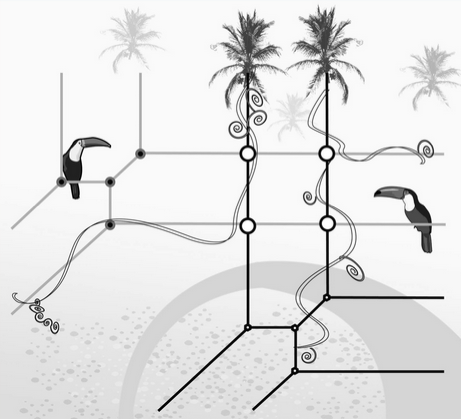

<table width="100%" height="100%" cellspacing="0" cellpadding="0" border="0">
<tr>
<td style="padding: 1em 5em 1em 5em" valign="top" width="800">

<h1>
MiniWorkshop on Tropical Geometry
</h1>
<h2>
Spring 2021
</h2>
<h2>
Official Website: 
 <a href="ag-yzhu.github.io/website/trop2021"> ag-yzhu.github.io/website/trop2021 </a> 
</h2>

All lectures will be host virtually online. For Zoom links and passcodes please contact the organizers

 
 

<h2>
Lecture Schedule
</h2>

<h3>
 Speaker I: <a href="https://www.mn.uio.no/math/english/people/aca/krisshaw/"> Dr. Kristin Shaw </a> 
 </h3>
<table width="50%" cellspacing="1" cellpadding="1" border="0" style="border-width: 1px; border-color:#000000; border-style: solid;">
<tr><td width="50%">Lecture I: A brief introduction to tropical geometry  </td> <td width="30%">    GMT+8, Wed, 06/09, 20:00  </td> <td width="20%">  Zoom Id 840 0465 8756 ; p/w: 235711   </td>  </tr>
<tr><td width="50%">Lecture II: Tropical geometry and matroids   </td>  <td width="30%">  TBA  </td> <td width="20%">   TBA    </td></tr>
<tr><td width="50%">Lecture III: Tropical cohomology and its properties  </td>   <td width="30%">  TBA   </td> <td width="20%">     TBA  </td></tr>
</table>
 
<h3>
 Speaker II: <a href="https://juliettebruce.github.io/"> Dr. Juliette Bruce </a> 
 </h3>
<table width="50%" cellspacing="1" cellpadding="1" border="0" style="border-width: 1px; border-color:#000000; border-style: solid;">
<tr><td width="50%">On the top-weight rational cohomology of A_g (part I)</td> <td width="30%">GMT+8, Thu, 06/10, 09:00 </td> <td width="20%">Zoom Id  835 1619 7249; p/w: 235711 </td> </tr>
<tr><td width="50%">On the top-weight rational cohomology of A_g (part II)</td> <td width="30%"> GMT+8, Fri, 06/11, 09:00 </td> <td width="20%">Zoom Id  835 1619 7249; p/w: 235711 </td></tr>
</table>
 
 <h3>
 Speaker III: <a href="https://npflueger.github.io//"> Dr. Nathan Pflueger </a> 
 </h3>
<table width="50%" cellspacing="1" cellpadding="1" border="0" style="border-width: 1px; border-color:#000000; border-style: solid;">
<tr><td width="60%">Lecture I:  Tropical plane curves </td> <td width="20%">    GMT+8, Fri 6/11 20:30  </td> <td width="20%">  Zoom Id 840 0465 8756 ; p/w: 235711  </td> </tr>
<tr><td width="60%">Lecture II: Tropical Riemann-Roch and Brill-Noether theory </td> <td width="20%"> GMT+8, Tue  6/15 09:00 </td> <td width="20%">  Zoom Id 835 1619 7249 ; p/w: 235711 </td> </tr>
<tr><td width="50%">Lecture III: Tropical curves via specialization and non-archimedean analytification</td><td width="20%"> GMT+8, Thu  6/17 09:00 </td><td width="20%"> Zoom Id 835 1619 7249 ; p/w: 235711 </td> </tr>
</table>

<h3>
 Speaker IV: <a href="https://math.stanford.edu/~hspink/"> Dr. Hunter Spink </a> 
 </h3>
<table width="70%" cellspacing="1" cellpadding="1" border="0" style="border-width: 1px; border-color:#000000; border-style: solid;">
<tr><td width="45%">TBA</td> <td width="10%"> TBA     </td> <td width="30%">     </td> <td width="25%">       </td></tr>
<tr><td width="45%">TBA</td> <td width="10%"> TBA     </td> <td width="30%">     </td> <td width="30%">       </td></tr>
</table>

 
<h3>
Organizers: 
</h3>

Xiping Zhang:&nbsp  xzhmath@gmail.com

 <a href="https://ag-yzhu.github.io/"> Yuwei Zhu </a>:&nbsp  yuwei_zhu@fudan.edu.cn

<td  width="600" style = "vertical-align: top">

<table width="600" cellspacing="0" cellpadding="0" border="0">
<tr><td colspan="6"></td></tr>
 <tr><td colspan="6">
This picture is from Bing Image
 </td></tr>
</table>
&nbsp;

</td>
</tr>

</table>
